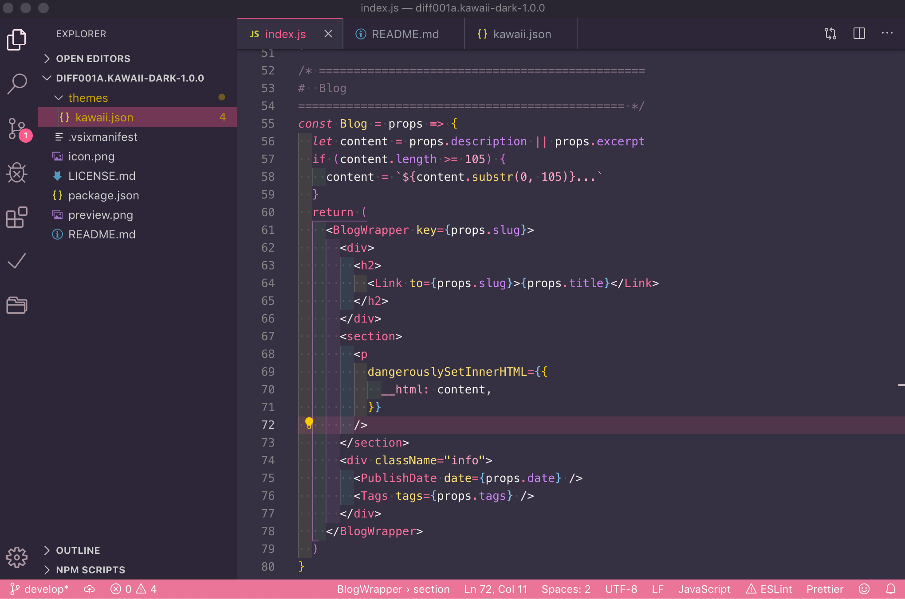

台風で予定が潰れてめっちゃ暇だったので、この暇を利用して VSCode のテーマを作って、Marketplace に公開するところまでやってみました。

ピンク率高めのかわいいダークテーマが欲しいなーと思ってたので、そういうイメージで作ってみました。少し紫がかったブラックを背景色にしたことで、甘くなりすぎず、可読性も保てて結構いい感じになったんじゃないかなーと思います ✨[今回作成したテーマの Marketplace ページはこちらから](https://marketplace.visualstudio.com/items?itemName=Shin-tech25.kawaii-theme)

今回の記事では、**Marketplace に自作の拡張機能を公開する方法**についてまとめておきたいと思います。テーマの開発方法については今回の記事で触れませんので、そっちを詳しく知りたい方は[公式ガイド](https://code.visualstudio.com/api/references/theme-color)を見てくださいね！

## まずは Azure DevOps のアカウント作成 & アクセストークンを取得

[Azure DevOps](https://dev.azure.com/)でアカウントを作成してログインします。

ログインしたら管理画面右上の自分のアイコン部分をクリックして、`Security`を選択します。

すると、Personal Access Token ページが表示されるので、`+ New Token`をクリックして新しいアクセストークンを作成します。この時に注意するのは、以下ふたつの項目です。

- **Scopes**は**Full Access**を設定しておく事
- **Organization**は**All accessible organizations**を設定しておく事

このふたつは気をつけないと後々エラーが出るので**絶対に確認しましょう！！！**

後は適当な名前をつけて、`create`ボタンをクリックするとアクセストークンが表示されるので、どこかにメモしておいてください。このトークンは一度画面を閉じてしまうと**後から確認することができません。**ここでメモしておくのを忘れないように気をつけましょう ✨

## vsce のインストールと設定

Marketplace に登録するのに`vsce`というツールが必要になるので、先にインストールと Publisher の設定を済ませておきます。

### vsce をインストール

```
npm install -g vsce
```

### Publisher の設定

この途中で、さっきメモしたアクセストークンを聞かれるので入力してください。

```
vsce create-publisher Publisher名
vsce login Publisher名
```

**publisher 名**の部分はお好きな名前に変更してください。

## Marketplace に登録するのに必要なファイルを用意する

Marketplace に登録するには以下のファイルが必要になります。

- アイコン画像
- package.json
- README.md
- LICENSE.md

README と LICENSE は、普段 github を使っている方ならなんとなく書き方はわかるかと思いますので、説明を省略します。

注意する必要があるのは、**package.json**の内容です。最低限以下の記述は必須となります。

```json
  "name": "theme-no-namae",
  "displayName": "テーマの名前",
  "version": "1.0.0",
  "publisher": "Publisher名",
  "description": "テーマの説明",
  "icon": "アイコン画像.png",
  "engines": {
    "vscode": "*"
  },
  "galleryBanner": {
    "color": "#353042",
    "theme": "dark"
  }
```

重要なのは**publisher**の部分です。**先ほど vsce の設定で指定した名前(publisher 名)**と同じ名前にしておかないと、エラーがでて公開が完了しませんので注意してください！

その他にも必須ではありませんが、カテゴリーやタグなどエクステンションのメタ情報も package.json から設定できます。詳しくは[今回作成したテーマの github ページ](https://github.com/Shin-tech25/KawaiiTheme)を参考にしてみてください！

## Marketplace に公開

ここまでできたら、package.json が置いてあるフォルダに移動して以下の vsce コマンドを実行しましょう！

```
vsce publish
```

これで Marketplace に公開されているのが確認できたらリリース完了です！お疲れ様でした 🎉

## 追記

全然関係ないんですが、テーマを新しくしたついでにエディタのフォントも[Fira Code](https://github.com/tonsky/FiraCode)に変更してみました 😄

コーディング用途に特化したフォントで、コーディングでよく使うコード(`>=` `==` `!=`など)が**合字**になり個人的にはめっちゃ読みやすくなったのでおすすめです 🌈
