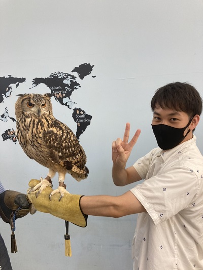
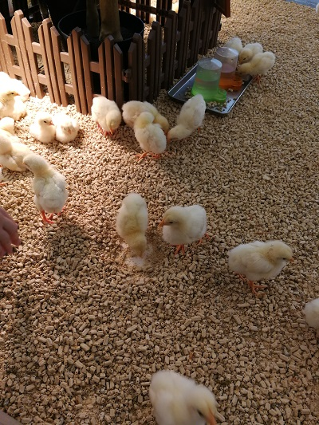
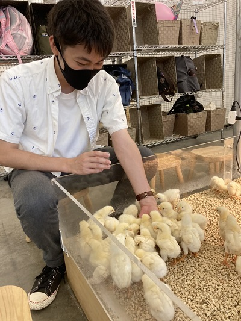
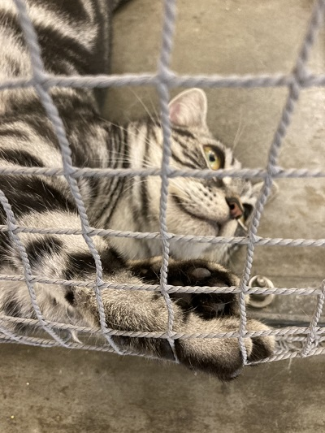
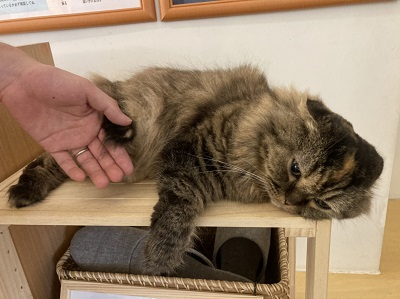

## 醍醐味

Moff animal cafe イーアス高尾は、室内で動物と触れ合うことができるこじんまりした動物園です。常時 15 ～ 20 種の動物達と触れ合うことができ、フリードリンクを飲みながらゆったりすることができます。イメージとしては、カフェと動物園の中間みたいな場所でした。

都内の猫カフェは忙しく時間制限を設けている場所も多い印象ですが、ここは時間制限等は特にないのが特徴です！

公式ページはこちら → [Moff animal cafe イーアス高尾](https://takao.iias.jp/shop/detail/1020.html)

## フクロウとの触れ合い

フクロウとの触れ合いが出来る珍しいコーナーです。大きなワシミミズクを腕に乗せて「フクロウ体験」をすることが出来ました。

## リクガメの散歩

リクガメはマイペースで非常に気まぐれです。そして、私の写真も気まぐれだったようで撮影するのを忘れてしまいました。リクガメの名前は「石塚さん」だったことを覚えています（何故、石塚さんなのかは分かりません）。石塚さんの散歩は偶に見ることが出来ますよ。

## ひよこコーナー

室内に入ってすぐの場所にひよこコーナーがあります。ひよこさん達は皆元気で、エサを与えると近寄って食べてくれます。モフモフしていて温かったです。

## 犬猫コーナー

犬さん猫さんも十数匹いました。猫さんはちょっとクールなのが特徴（笑）。ただし、エサにはすぐに食いついて来ます。ダラけている様子がとても可愛い。

## アクセス

最寄り駅 JR 高尾駅 から徒歩 5-10 分程度です。駅から直線で歩くだけですのでとても分かり易い！

## 公式ページ

[Moff animal cafe イーアス高尾](https://takao.iias.jp/shop/detail/1020.html)
