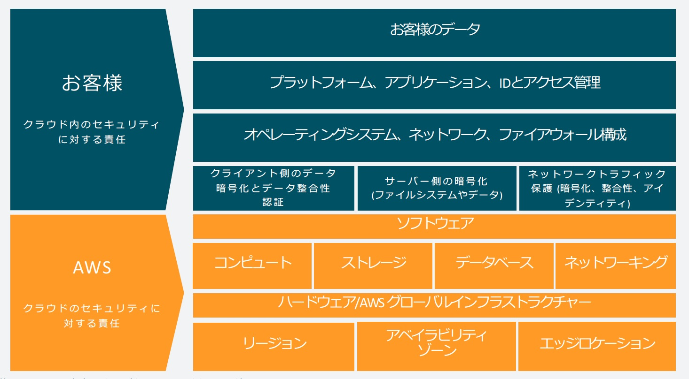

# AWS のセキュリティ

AWS は「AWS においてセキュリティは最優先事項」と言い切っています。AWS は圧倒的なコストをかけてセキュリティを担保しています。

特徴として、AWS が担保する範囲とユーザーが注意して守るべき範囲を分けています。これを AWS の責任共有モデルと言います。

[公式ページ（AWS の責任共有モデル）](https://aws.amazon.com/jp/compliance/shared-responsibility-model/)

# AWS セキュリティの利点

## データの保護

AWS インフラストラクチャには、ユーザーのプライバシーを保護するための強力な安全対策が用意されています。全てのデータは安全性が非常に高い AWS データセンターに保存されます。

## コンプライアンスの要件に準拠

AWS では、インフラストラクチャ内で数多くのコンプライアンス・プログラムを管理できます。つまり、コンプライアンスの一部は最初から達成されています。

## コスト削減

AWS データセンターを利用することでコストを削減できます。ユーザーが独自の施設を管理する必要がなく、最上位のセキュリティを維持できます。

## 迅速なスケーリング

AWS クラウドの使用量に合わせてセキュリティをスケーリング出来ます。ビジネスの規模にかかわらず、AWS インフラストラクチャによってユーザーのデータが保護されます。
