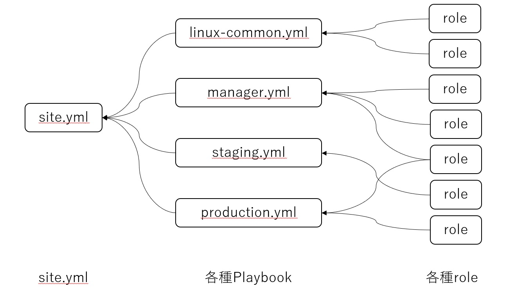
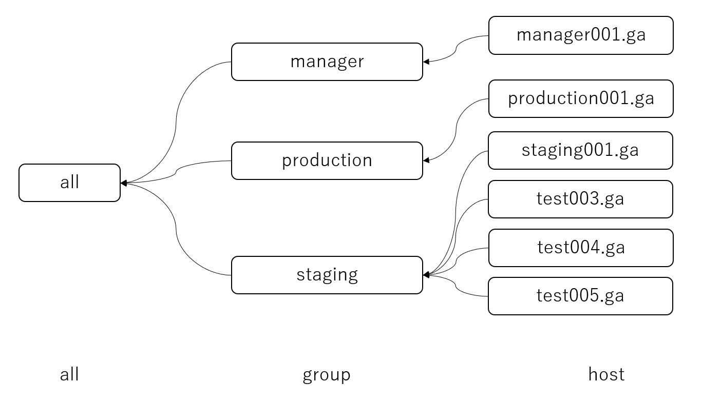

このページでは、保守的な Playbook の書き方、冪等性などをしっかりと考慮した Playbook や tips を紹介しています。シンプルでクリーンな Playbook を作成しましょう。

Ansible は Red Hat 社により開発されているサーバプロビジョニング・ツールです。Linux を始めとして、Windows、Cisco 機器などに対しても設定変更を行うことができます。汎用性が高いことがメリットです。

一方、設計段階で Playbook( = Ansible 実行コード)の設計方針をしっかりと決めなければ、Playbook と処理の対応関係が次第に分かりづらくなり、保守に時間がかかるコードを量産してしまうことに繋がります。

業務で実際に複雑な Playbook を見てきました。見ただけでは実際に何をする処理なのか分かりづらく、ミスの温床になります。

そういった Playbook を作らないためにどうしたら良いか。以下に記載しました。

## 概要

保守的な Playbook を考える上でも観点はいくつかあります。
その中でも特に重要な観点を以下に挙げました。

- トップダウン設計
- インベントリ設計
- ドライランチェック
- 冪等性
- 変数の設計

について挙げていきます。

### トップダウン設計

Playbook の設計で最も重視すべきなのがこのトップダウン設計です。

- site.yml
- 各種 Playbook
- role

この順番に Playbook を記述していきます。実際の処理(Task)は、role にだけ記述します。`site.yml`や Playbook には、対応関係のみを記述します。こうすることで、メンテナンスしやすくなります。

`site.yml`は以下のように、Playbook を`import_playbook`により import します。

```YAML
---
- name: Linuxの共通設定(all)
  import_playbook: linux-common.yml

- name: Manager 用の設定
  import_playbook: manager.yml

- name: Staging用の設定
  import_playbook: staging.yml

- name: Production用の設定
  import_playbook: production.yml
```

各種 Playbook は以下のように、`role` を用いて処理を記述していきます。なお、`role`は`roles`の下にネストして、`tags`を付与します。
このようにすることで、`role`の局所的使用を可能にします。

```YAML
---
- name: Linux の共通設定用の Playbook
  hosts: linux
  become: true
  gather_facts: true

  roles:
  # ホスト名変更
  - role: change_hostname
    tags: change_hostname

  # 共通パッケージインストール
  - role: linux_common_packages
    tags: linux_common_packages

  # firewalld 有効化と設定
  - role: firewalld_setup
    tags: firewalld_setup

  # sshd 有効化と設定
  - role: sshd
    tags: sshd

  # docker インストール
  - role: install_docker
    tags: install_docker

  # SELinux 無効化と必要なら再起動
  - role: selinux
    tags: selinux
```

図にすると以下のようになります。


### インベントリ設計

以下に YAML 形式でのインベントリを例として記載しました。

YAML 形式では、`children:`の下に位置するグループがその上のグループに所属することになります。また、`hosts:`の下に位置するホストがその上のグループに所属することになります。

例えば、グループ`manager`、`staging`、`production`は`linux`グループに所属しており、同時に`all`に所属しています。（`all`は特別なグループで全てのホストが必ずこれに属しています。）`staging001.ga`、`test003.ga`、`test004.ga`は`staging`グループと`all`グループに所属しています。

hosts.yml

```YAML
all:
  children:
    linux:
      children:
        manager:
        staging:
        production:
    manager:
      hosts:
        manager001.ga:
    staging:
      hosts:
        staging001.ga:
        test003.ga:
        test004.ga:
        test005.ga:
    production:
      hosts:
        production001.ga:
```

ホストやグループの変数（Inventory Variables）は、`host_vars/`、`group_vars/`の下にそれぞれのホストやグループの名前を冠した YAML ファイルを配置し記載します。

以下にディレクトリ構造の例を記載します。

```
Ansible/
  inventory/
    group_vars/
      all.yml
      manager.yml
      production.yml
      staging.yml
    host_vars/
      manager001.ga.yml
      production001.ga.yml
      staging001.ga.yml
      test003.ga.yml
      test004.ga.yml
      test005.ga.yml
    hosts.yml
```

グループも意識しないと沢山出来てしまいますが、原則として「一つの Playbook には、一つのグループが紐づく」ことを意識すると沢山のグループを作らずに済み可読性が上がります。グループには役割や機能を抽象化したものを記載すると分かりやすいです。例えば、Zabbix サーバなら zabbix グループという具合に。

今回の例で、インベントリの設計を図にしたものが以下になります。



### トップダウン設計によるメリット

トップダウン設計のメリットは単に可読性が上がり、スケーラビリティが高くなるだけではありません。コマンド実行が非常に簡単で運用も楽になります。Ansible には実際には沢山のオプションがあります。コマンド実行時にそれらを適切に付与してやる必要がありますが、トップダウン設計によってオプションもシンプルで簡単になります。

例えば、以下のようになります。

```
# ansible-playbook site.yml
```

これは、Playbook の総本山である`site.yml`をホストの制限なく実行されています。`site.yml`に指定されているホストは`all`です。また、`site.yml`は`linux-common.yml`、`manager.yml`、`staging.yml`、`production.yml`を import していますから、結果的に**必要なインフラが全て揃う**コマンドということになります。

以下はどうでしょうか？

```
# ansible-playbook site.yml -l staging
```

`-l`オプションは、ホストやグループを制限するオプションです。上の例では、`staging`グループに制限して`site.yml`を実行しています。実際には、`site.yml`を実行するのにはたとえ変更が全く無かったとしてもそれなりの時間を要します為、ホストやグループを制限して実行するのが普通です。しっかりとトップダウンで設計されていれば、Playbook は常に`site.yml`を指定して実行することができ、各種 Playbook を指定して実行することもできますがその必要がなくなります。これが最大のメリットです。

また、次の例も見てみましょう。

```
# ansible-playbook site.yml -l staging --tags httpd
```

この例では、httpd という`role`を指定して実行しています。`role`は`tag`でタグ付けしています。コマンド実行時に`--tags`で指定した`role`を実行することができます。このようにすることで`role`の局所的使用を可能にします。

まとめると、以下のようなコマンドで Playbook を実行することができます。

```
# ansible-playbook site.yml < -l (指定したターゲット) > < --tags (role名) >
```

トップダウン設計することで、Playbook の実行コマンドがシンプルになりました。

### ドライランチェック

ドライランチェックには、`ansible-playbook site.yml --check`のように、`--check`をオプションとして付与して実行します。
Playbook を実行する前に、冪等性のチェックと同様にドライランチェックを実行しましょう。
ドライランチェックを実行した際に問題が無いような Playbook の設計をしましょう。

### 冪等性

Playbook が冪等性が保たれていることを確認するために、最も簡単な方法は Playbook を二度実行して変更箇所が無いかどうか確認することです。
ただし、これはサーバの設定変更が反映されてしまいます。冪等性を確認するために Ansible が用意してくれているツールがあります。それが、`Ansible Molecule`です。

`Molecule`では、`Role`の開発支援とテスト自動化を行うことが出来るツールで、テストの部分に注目すると以下のテストを行えるとされている。

- Lint チェック
- Docker 内での Playbook 実行
- 冪等性チェック
- テストコードの実行

Ansible Molecule の使い方については、別のページで詳しく書くことにしますが品質を考えるとこれは便利そうです。

### 変数の設計

Playbook では、Vars セクションに限らず、様々なところで変数を定義することが出来ます。他の多くのプログラミング言語と同じく、スコープが狭い変数のほうが優先度が高い（＝上書きされる）特徴があります。

参照範囲は 3 つのスコープに分かれます。

- Global 領域

  - 環境変数(environment vars)
  - エキストラ変数(extra vars)

- Play 単位

  - プレイ変数(play vars)
  - タスク変数(task vars)
  - ロール変数(role vars)

- Host 単位

  - インベントリ変数(inventory vars)
  - ファクト変数(host facts)
  - レジスタ変数(registered vars)

変数をどこで定義しているかで Playbook 自体の汎用性も変わってきます。ホストやグループに紐づく変数はインベントリ変数、role は汎用的に定義して Playbook の方でタスク変数としてロールのデフォルト変数を上書きするなどの工夫が必要です。実際には何が正解ということはないですが、上で書いたようなことを意識した上で汎用性の高い Playbook を設計しましょう。

### 内部リンク

### 参考

- [Ansible のテストツール Molecule でできること](https://dev.classmethod.jp/articles/ansible-molecule/)

```

```
