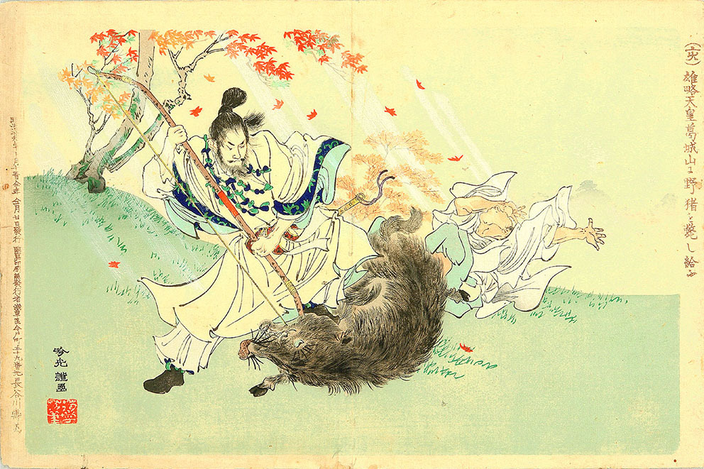

# 雄略天皇

雄略天皇は五世紀の人物です。中国の歴史書（＝宋書倭国伝）では、「倭王武」と記載されており、埼玉県の稲荷山古墳から出土した辛亥名鉄剣の銘文に見える「獲加多支鹵大王」が「記紀」にいう「ワカタケル」天皇すなわち雄略天皇であることはほぼ確実だと考えられています。

猪狩りをする雄略天皇（安達吟光画）

出典 Wikipedia

# 参考

- [世界の歴史まっぷ 雄略天皇](https://sekainorekisi.com/glossary/%E9%9B%84%E7%95%A5%E5%A4%A9%E7%9A%87/)
